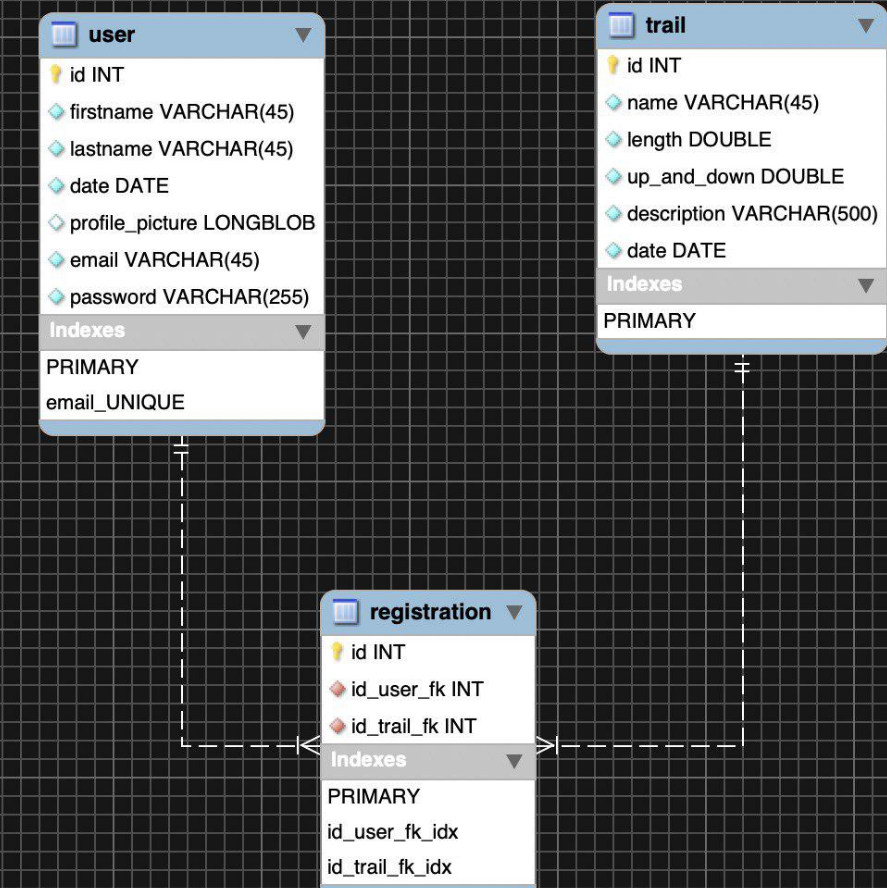

# Rapport : Projet N°2 - API Trail

## Description globale

Nous avons créer deux API. La première permettant de s’authentifier (à l'aide d'un token) et la deuxième de gérer des trails. Notre première API ne sert qu'à s'authentifier, ce qui permettra au client d'utiliser la deuxième API. Grâce à la première API, un utilisateur peut modifier son mot de passe mais pas celui d'un autre utilisateur. L'utilisateur est authentifié à l'aide d'un Token JWT. Si un utilisateur est considéré comme un admin (et seulement si c'est un admin), il peut créer un nouvel utilisateur. Pour la seconde API, lorsqu'un utilisateur est authentifié, il peut créer, modifier et supprimer un trail.  L'utilisateur peut aussi voir la liste de tous les trails, s'y inscrire ou s'y désinscrire. Il peut aussi modifier ses infos personnelles. 

## Description des entités

Dans la **première API**, nous n'avons qu'une seule entité. L'entité **user**, elle est formé de la manière suivante : un identifiant unique, un rôle (regular ou admin), un email (unique servant comme username), un mot de passe (hashé avec la fonction BCrypt).

Dans la **deuxième API**, nous avons comme pour le premier projet, trois entités. La première est l'entité **user **, la seconde est l'entité **trail** et la troisième, l'entité **Registration**, que nous allons détaillé ci-dessous. 

##### User :

L'entité user représente un utilisateur caractérisé par un ID unique généré automatiquement par la base de données. Des informations personnelles tel que le nom, le prénom, la date de naissance. L’émail est aussi unique et sert d'identifiant pour l'utilisateur. Il possède aussi un mot de passe que nous n'avons pas retirer mais qui n'est pas utilisé (car on s'authentifie dans la première API)

##### Trail :

L'entité trail représente une randonnées, elle possède elle aussi un ID unique généré automatiquement par la base de données. Elle possède ensuite toutes les informations nécessaire à sa définition tel que son nom, sa distance, sa dénivellation, sa description et sa date.

##### Registration :

L'entité registration est le lien entre nos deux première entités. Elle est composé d'un ID unique généré automatiquement par la base de données, de l'ID d'un utilisateur et de l'ID du trail auquel ce dernier souhaite s'inscrire.

## Implémentation

## Bugs & Limitations