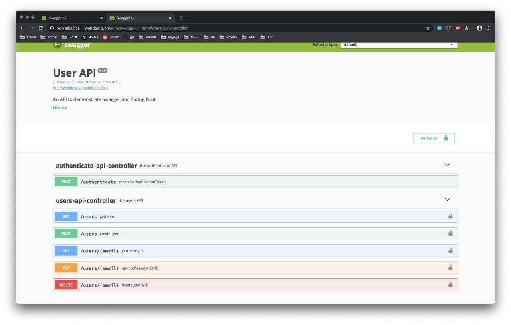
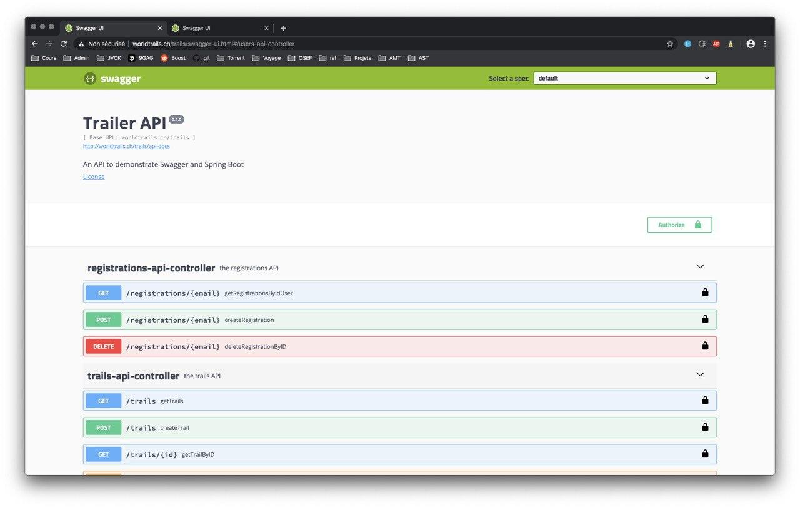
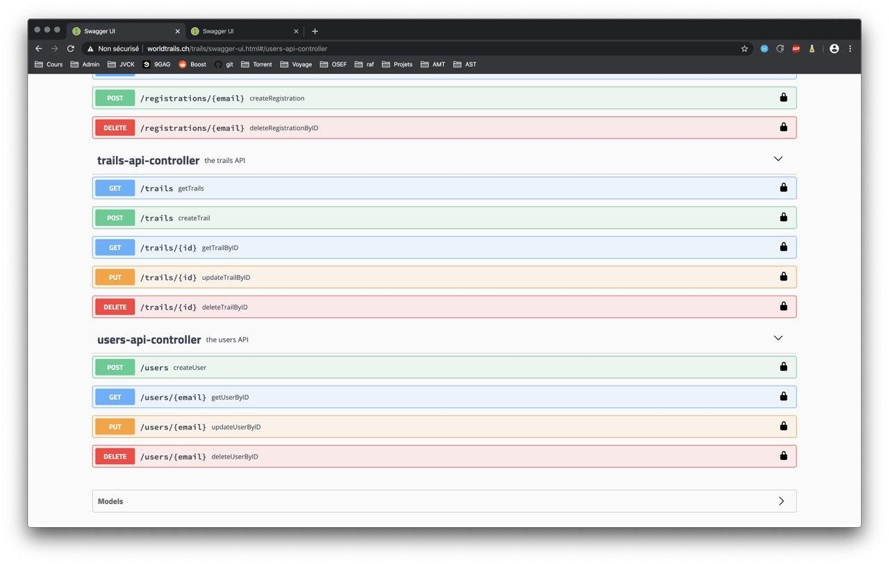
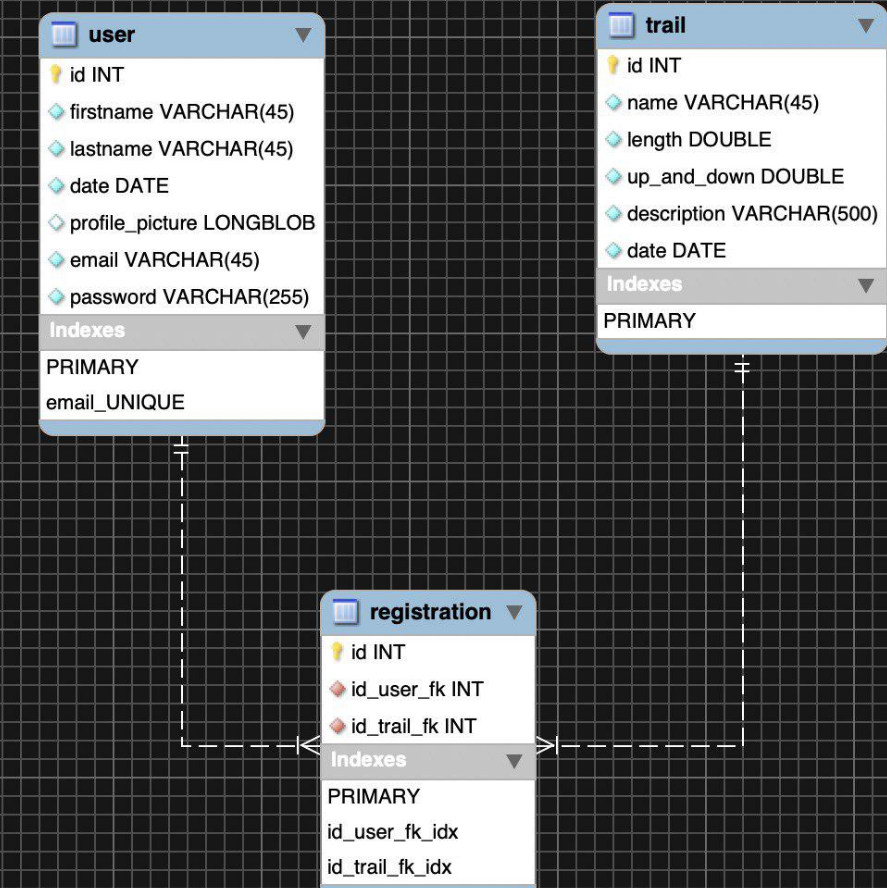

# Rapport : Projet N°2 - API Trail

## Description globale

Nous avons créer deux API. La première permettant de s’authentifier et la deuxième de gérer des trails. Notre première API ne sert qu'à s'authentifier, ce qui permettra au client d'utiliser la deuxième API. L'utilisateur est authentifié à l'aide d'un Token JWT (sans ce token aucune des fonctionnalités suivantes n'est possible). Grâce à la première API, un utilisateur peut modifier son mot de passe mais pas celui d'un autre utilisateur. Si un utilisateur est considéré comme un admin (et seulement si c'est un admin), il peut créer un nouvel utilisateur. Pour la seconde API, lorsqu'un utilisateur est authentifié, il peut créer, modifier et supprimer un trail.  L'utilisateur peut aussi voir la liste de tous les trails, s'y inscrire ou s'y désinscrire. Il peut aussi modifier ses infos personnelles. 

Aperçu de la première API (users).

Aperçu de la deuxième API (trails)

## Description des entités

Dans la **première API**, nous n'avons qu'une seule entité. L'entité **user**, elle est formé de la manière suivante : un identifiant unique, un rôle (regular ou admin), un email (unique servant comme username), un mot de passe (hashé avec la fonction BCrypt).

Dans la **deuxième API**, nous avons comme pour le premier projet, trois entités. La première est l'entité **user**, la seconde est l'entité **trail** et la troisième, l'entité **Registration**, que nous allons détaillé ci-dessous. 

##### User :

L'entité user représente un utilisateur caractérisé par un ID unique généré automatiquement par la base de données. Des informations personnelles tel que le nom, le prénom, la date de naissance. L’émail est aussi unique et sert d'identifiant pour l'utilisateur. Il possède aussi un mot de passe que nous n'avons pas retirer mais qui n'est pas utilisé (car on s'authentifie dans la première API).

##### Trail :

L'entité trail représente une randonnées, elle possède elle aussi un ID unique généré automatiquement par la base de données. Elle possède ensuite toutes les informations nécessaire à sa définition tel que son nom, sa distance, sa dénivellation, sa description et sa date.

##### Registration :

L'entité registration est le lien entre nos deux première entités. Elle est composé d'un ID unique généré automatiquement par la base de données, de l'ID d'un utilisateur et de l'ID du trail auquel ce dernier souhaite s'inscrire.

## Implémentation

#### Interceptors

Toutes les requêtes passent par un interceptor, ce qui permet de pré-traiter ces dernières. Ainsi un utilisateur sans token ne pourra pas accéder à une partie demandant une autorisation.

Pour différencier les administrateurs et les utilisateurs normaux, nous avons ajouté deux filtres différents. Typiquement pour la création d'un utilisateurs, ainsi que pour la lecture de tous les utilisateurs.

#### Endpoints

Le endpoint authentification comprend deux contrôleurs. Les contrôleurs permettant de rediriger les requêtes sur les services approprier. Ce modèle a été appliquer à tous les endpoints.

#### Services

Les services permettent de traiter les requêtes envoyé par le contrôleur.

Les services s'occupent de faire les appels à MySQL pour traité les données. 

#### Modèles

L'entité user de la première API ne suit pas exactement ce qui était demandé dans la donnée car dans notre cas, le prénom et le nom d'un utilisateur se trouvent déjà dans la deuxième API.

#### Pagination

Les deux APIs implémentent la pagination. La méthode getUsers (voir tous les utilisateurs. Seulement utilisable pas un admin) de la première API (authentication) l'utilise car il y a un nombre important d'utilisateurs. Le même schéma est utilisé, par les différentes méthodes utilisant la pagination. L'attribut pageNumber permet de sélectionner la page et numberOfEntitesPerPage permet de sélectionner le nombre d'éléments que nous désirons voir par pages.

#### Gestion d'association

Pour associer un trail à un user, on utilise l’entité registration qui permet d'ajouter un utilisateur à un trail (une randonnée). Si un trail ou un utilisateur est supprimé,  la base de données se charge d’effacé les registrations correspondantes. 

## Bugs & Limitations

Après avoir installer traefik dans notre infrastructure, la plupart des tests cucumber ne fonctionnent plus, tous ceux nécessitant un token dans le header. Pour cela, nous avons utilisé la classe APIClient, permettant d'ajouter le token au header, mais après l'ajout de traefik, l'adresse contenu dans la variable api n'est plus la bonne.